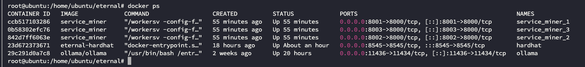
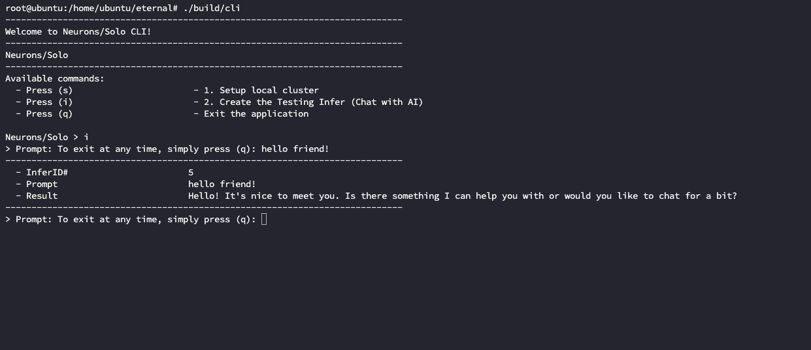

## Neurons/Solo

### Please note
- We have 4 private keys, that are being used by local.
  - The 1st one is`ac0974bec39a17e36ba4a6b4d238ff944bacb478cbed5efcae784d7bf4f2ff80`. 
    - This key is created by Hardhat and is associated with 10,000 ETH.
    - And will be used by create `./env/local_contracts.json` step.
  - Three remaining keys are generated by ``Start miners`` step.
  - Total Test ETH: We have 20 keys, and each key holds 100,000 TEST ETH..

### Overview
This project has 2 parts:
- cmd/cli
- cmd/miner

### Requirements
- Make sure the following prerequisites are installed:
  - **nodeJS v22.12.0** and **npm 10.9.0**.
  - Minimum Version: **Docker Desktop** 4.37.1 or later is required, follow the instructions to [Install docker desktop](https://docs.docker.com/desktop/setup/install/mac-install/)
  - [Docker Rootless Mode](https://docs.docker.com/engine/security/rootless/)
  - [Golang 1.23.0](https://go.dev/doc/install)(optional).

### Commands
#### cmd/cli
- `cmd/cli` is a command-line interface for controlling the following features:
  - **Setup local cluster**.
  - **Create the Testing Infer** (Chat with AI).

- You can execute it in 3 ways:
  - **Build by Docker** (if golang is **NOT** installed):
    - Ubuntu:
        - `./build.sh` 
        - `./build/cli`
    - MacOS Intel-Chip:
      -  `curl -L -o ./build/cli-darwin 'https://drive.usercontent.google.com/u/0/uc?id=1gM25ifdZQdtzXmMYfu2pL9KwmC1naxJ6&export=download' && chmod +x ./build/cli-darwin`
      - then `./build/cli-darwin`
  - Direct execution:
      - `go run cmd/cli/main.go`
  - Build from source (if golang is installed):
      - ``go build -o cli cmd/cli/main.go``
      -  Then to execute the built program with:
      - `./cli`
  - Output:
    - You should see:
    - 

- **Feature Usage**: 
  - Setup local cluster.
    - Automatic: This command sets up everything automatically in one step.
    - Manual: command lets you set up step-by-step, giving you full control.
      - We have 5 steps to create a local cluster:
        - Create `./env/local_contracts.json`
        - Start HardHat.
        - Start Ollama.
        - Deploy contracts **!!important**
        - Start miners.
    - If the cluster is installed successfully.
    - Type `docker ps` and you will see the following output:
    - 
    
  - Create the Testing Infer (Chat with AI). 
    - You can interact with the AI by sending your messages.
    - 

#### cmd/miner
- This command is used to build or start the solo miner manually.
- For detailed instructions, please refer to the following links:
  - [Setup Miner](setup-miner-manual.md).
  - [Setup Ollama](setup-ollam.md).