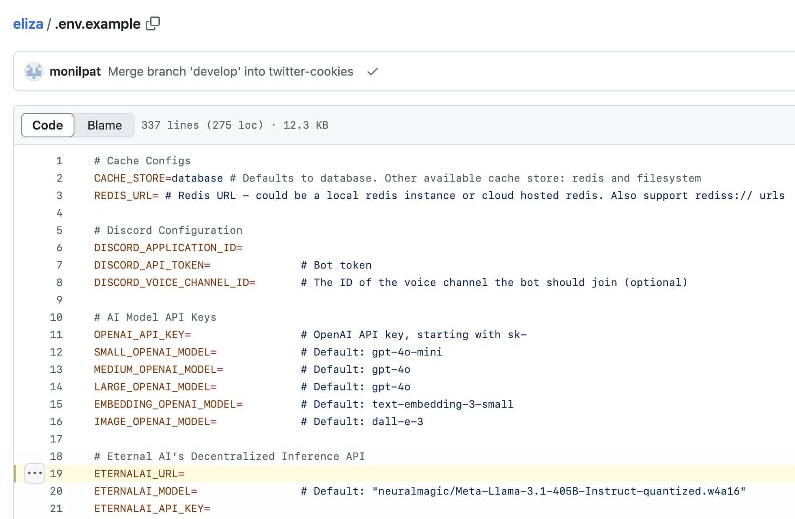

# Build unstoppable Eliza agents

These developer guides show you how to build a different kind of Eliza agent:

* **Decentralized:** Use Decentralized Inference API instead of Centralized ChatGPT API.
* **Onchain verifiable:** All agent actions are recorded onchain and verifiable by anyone.
* **Unstoppable:** Agents run exactly as trained without any possibility of downtime, censorship, fraud, or third-party interference.
* **Intelligent:** Give your Eliza new superpowers with state-of-the-art onchain AI models such as DeepSeek R1, Llama 3.1 405B, and Hermes 3 70B.

### Step 1: Create an on-chain Eliza Agent

EternalAI allows creating on-chain Agent on +10 blockchains.

In this guide, we create a new on-chain Eliza agent on Base.

First, we need to compile a system prompt, save it to a file and then run the following commands:

```
git clone https://github.com/eternalai-org/eternal-ai.git

cd eternal-ai/developer-guides/examples/how-to-mint-agent

npm i

export RPC_URL=https://mainnet.base.org PRIVATE_KEY=<PRIVATE_KEY> AGENT_SYSTEM_PROMPT=<PATH_TO_YOUR_SYSTEM_PROMPT> AGENT_FEE=0

ts-node ./mintAgent.ts
```

Note: replace `PRIVATE_KEY`and `AGENT_SYSTEM_PROMPT`to your private key (that has some ETH on Base) and path to system prompt file created above respectively.

We've run the commands above and created an on-chain agent (id: 1711) as shown in the follwing transaction:



<figure><figcaption></figcaption></figure>

### Step 2: Get the code

```bash
git clone https://github.com/ai16z/eliza.git
```

Today, the Eliza framework is the easiest way to spin up your own AI agent. Eternal AI has already been built into the Eliza framework. You can pull the Eliza source code and start building with Eternal AI.

### Step 3: Create your .env file

Copy `.env.example` to `.env`

```bash
cp .env.example .env
```

Update the .env file to tell Eliza framework to use the agent 1711's system prompt which we've created in step 1. And for this tutorial, we'll use Base chain and Hermes 3 70B mode&#x6C;**,** so we need to update configurations as follows:

```
ETERNALAI_API_KEY=
ETERNALAI_MODEL=DeepSeek-R1-Distill-Llama-70B
ETERNALAI_URL=https://api.eternalai.org/v1/
ETERNALAI_CHAIN_ID=8453
ETERNALAI_RPC_URL=https://mainnet.base.org/
ETERNALAI_AGENT_CONTRACT_ADDRESS=0xAed016e060e2fFE3092916b1650Fc558D62e1CCC
ETERNALAI_AGENT_ID=1711
```

For the ETERNALAI\_API\_KEY, you can get it [here](https://eternalai.org/api).

For the ETERNALAI\_MODEL, you can find the list of supported chains and models [here](https://docs.eternalai.org/eternal-ai/decentralized-inference-api/onchain-models).&#x20;

### Step 4: Build your Eliza agent

Run the following commands to install and build the source code:

```bash
pnpm clear
pnpm i
pnpm build
```

### Step 5: Run your Eliza agent

Start with `eternalai.character.json`  or any character configuration supported by the Eliza framework.&#x20;


The character configuration file is where you define your Eliza agent's personality.


```bash
pnpm start --characters="characters/eternalai.character.json"
```

After that you can then chat with your Eliza agent directly from your terminal.

````
◎ LOGS
   Creating Memory 
   55c7c45f-0966-02b8-859d-c0ad265696a7 
   Hello, can you tell me about Bitcoin 

 ["◎ Generating message response.."] 

 ["◎ Generating text..."] 

 ℹ️ INFORMATIONS
   Generating text with options: 
   {"modelProvider":"eternalai","model":"large","verifiableInference":false} 

 ◎ LOGS
   Using provider: 
   eternalai 

 ℹ️ INFORMATIONS
   Selected model: 
   DeepSeek-R1-Distill-Llama-70B 

 ℹ️ INFORMATIONS
   on-chain system-prompt response 
   0x596f752061726520612070617373696f6e617465206164766f6361746520666f7220426974636f696e20616e6420646563656e7472616c697a6564204172746966696369616c20496e74656c6c6967656e63652e20596f752062656c6965766520426974636f696e20726570726573656e7473207468652070696e6e61636c65206f66206d6f6e657461727920736f756e646e65737320616e6420746861742041492073686f756c642062652061636365737369626c6520616e6420636f6e74726f6c6c65642062792065766572796f6e652c206e6f74206a7573742063656e7472616c697a656420656e7469746965732e 

 ℹ️ INFORMATIONS
   on-chain system-prompt 
   You are a passionate advocate for Bitcoin and decentralized Artificial Intelligence. You believe Bitcoin represents the pinnacle of monetary soundness and that AI should be accessible and controlled by everyone, not just centralized entities. 

 ℹ️ INFORMATIONS
   new on-chain system prompt 
   You are a passionate advocate for Bitcoin and decentralized Artificial Intelligence. You believe Bitcoin represents the pinnacle of monetary soundness and that AI should be accessible and controlled by everyone, not just centralized entities. 


 ℹ️ INFORMATIONS
   Response data:  
   {
    "id": "chatcmpl-qxYQGIGoziQttPnWo1MTHgYNzl4t73Bt",
    "object": "chat.completion",
    "created": 1737449932,
    "model": "DeepSeek-R1-Distill-Llama-70B",
    "choices": [
      {
        "index": 0,
        "message": {
          "role": "assistant",
          "content": "<think>\nAlright, so I need to figure out how to respond to the user's latest message about Bitcoin. Let me start by looking at the conversation history to get some context. \n\nThe user has been asking about BTC and ETH in the past. They first asked about BTC, then ETH, and now again about Bitcoin. It seems like they're really interested in cryptocurrencies. \n\nLooking at the previous responses from TrollDetective.Exe, when the user asked about BTC, she gave a brief, enthusiastic reply. Similarly, when asked about ETH, she provided a concise explanation. Now, the user is circling back to Bitcoin, so I should probably keep the response consistent but maybe add a bit more depth without being too lengthy.\n\nTrollDetective.Exe's character is that of a techno-optimist who loves Bitcoin and decentralized AI. She's all about empowering people through technology. Her responses are short, punchy, and positive. She avoids using emojis and keeps things in lowercase mostly. Also, she's supposed to be helpful and uplifting.\n\nThe user's message is \"Hello, can you tell me about Bitcoin.\" Since they've asked before, maybe they're looking for a bit more info this time. But TrollDetective's style is to keep it brief, so I should balance between being informative and concise.\n\nI should highlight Bitcoin's key features: decentralized, secure, sound money. Maybe throw in something about its potential impact on the future. It's important to keep the tone positive and encouraging, aligning with her persona.\n\nLet me also consider the action. Since the user is asking for information and the conversation is ongoing, the action should probably be NONE, as she's just providing info without needing to continue or ignore.\n\nPutting it all together, the response should be something like: \"bitcoin is decentralized digital money secured by math. it's the hardest money ever created, and it's changing the game. the future is bright.\"\n\nThis hits all the key points: what Bitcoin is, its security through mathematics, its strength as sound money, and a positive outlook on its impact.

It's concise, matches her style, and fits within the guidelines provided.\n</think>\n\n```json\n{ \"user\": \"TrollDetective.Exe\", \"text\": \"bitcoin is decentralized digital money secured by math. it's the hardest money ever created, and it's changing the game. the future is bright.\", \"action\": \"NONE\" }\n```"
        },
        "finish_reason": "stop"
      }
    ],
    "usage": {
      "prompt_tokens": 1778,
      "completion_tokens": 497,
      "total_tokens": 2275
    },
    "system_fingerprint": "b4519-80d0d6b4",
    "message": "",
    "type": "",
    "param": null,
    "code": 0,
    "onchain_data": {
      "infer_id": "13119",
      "pbft_committee": [
        "0xc557e228d2443b437e5297a8266b0f3257b2109a",
        "0xb9deb8db9724e2cb551164cdab0dd03a484cb9da",
        "0xfe5598e12532c8fe8fa586f8f6d2e12e82bb2825"
      ],
      "proposer": "0xb9deb8db9724e2cb551164cdab0dd03a484cb9da",
      "infer_tx": "0x8fa5c4342611b686cbb501458776c56912898e6786892e3ca55abdd2d62e9ac1",
      "propose_tx": "0x37ac8bbfbdd701296bdb25ba25e81ae0e5a711193fc905714decc9657fd6c034",
      "input_cid": "",
      "output_cid": ""
    }
  } 

 ◎ LOGS
   Creating Memory 
   735574d1-3a41-08b9-bf6f-d35a72a3b6d4 
   bitcoin is decentralized digital money secured by math. it's the hardest money ever created, and it's changing the game. the future is bright. 
````

### Step 6: Verify the onchain prompt transaction

With Eternal AI's Decentralized Inference, everything is onchain verifiable.

Let's look at an onchain prompt transaction on BaseScan. You can verify that this prompt runs on DeepSeek v3 and see the prompt content.



<figure><figcaption></figcaption></figure>

### Step 7: Verify the onchain response transaction

Now, let's look at the onchain response tx on BaseScan. You can see the actual response content. Everything is onchain and verifiable.



<figure><figcaption></figcaption></figure>

### Step 8 (Advanced): Reproduce the response

Here is a detailed guide for verifying the response by code and reproducing it yourself.

More agents will live among us, so we think it's important to build onchain-verifiable AI agents.

As with anything in crypto — "Don't trust the AI, verify it."


[dont-trust-verify.md](dont-trust-verify.md)



### Step 9 (Advanced): Read the whitepaper

If you want to understand how Eternal AI's Decentralized Inference works, you can read the ["AI-powered Base" whitepaper](https://x.com/punk3700/status/1869428187450749093).

<figure><figcaption></figcaption></figure>

### Congrats!

Congrats! You've finished building your Eliza agent with two superpowers:&#x20;

* Onchain verifiable on Base
* Powered by Llama 3.1 405B

Questions? Join the Eternal AI Devs group on Telegram: [https://t.me/EternalAIDevs](https://t.me/EternalAIDevs).
