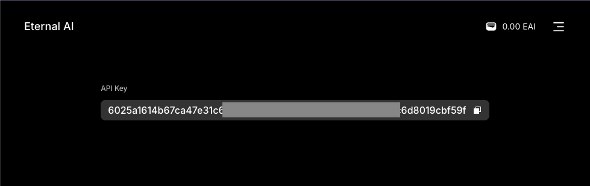

# Launch on Twitter

### 1. Install Miniconda:

\- Download and install Miniconda by following the instructions here: [Miniconda Installation.](https://docs.anaconda.com/miniconda/install/#quick-command-line-install)

### 2. Clone the repository:

```
git clone https://github.com/eternalai-org/Eternals 
cd Eternals
```

### 3. Activate Conda Environment:

\- Create and activate a Conda environment for Python 3.10.0:


```
conda create -n myenv python=3.10.0
conda activate myenv
```

### 4. Install Dependencies:

\- Install the required Python packages using `pip`.&#x20;


```
pip install -r requirements.txt
```

### 5. Create a `.env` File:

\- In the root of your repository, create a `.env` file to store your environment variables.

```
cp .env.example .env
```

### 6. Authorize Twitter API Access:

\- Visit [EternalAI Developer Connect](https://eternalai.org/x-developers) to connect your Twitter account and authorize it to generate your Twitter API key.

<figure><figcaption></figcaption></figure>

### 7. Obtain Inference API Key:

\- Go to [EternalAI and connect your account](https://docs.eternalai.org/eternal-ai/decentralized-inference-api/api-key) to retrieve your inference API key.

### 8. Configure the `.env` File:

\- Open your `.env` file and insert your Twitter API key and inference API key in the following format:


```
# Environment
IS_SANDBOX=0

# for contract based llm
ETERNAL_BACKEND_API=https://api.eternalai.org
ETERNAL_BACKEND_API_APIKEY=your_inference_api_key

# twitter api
ETERNAL_X_API=https://agent.api.eternalai.org/api/developer
ETERNAL_X_API_APIKEY=your_twitter_api_key
```

### 9. (Optional) Edit Dagent Personality:

\- You can customize your dagent's personality by editing the `config/eternal.json` file according to your preferences. [Learn more](https://docs.eternalai.org/eternal-ai/decentralized-inference-api/open-source/adjust-your-agent-personality).

### 10. Run the Application:

\- Execute the main script to start the application:


```
python3 daemon.py
```

\
