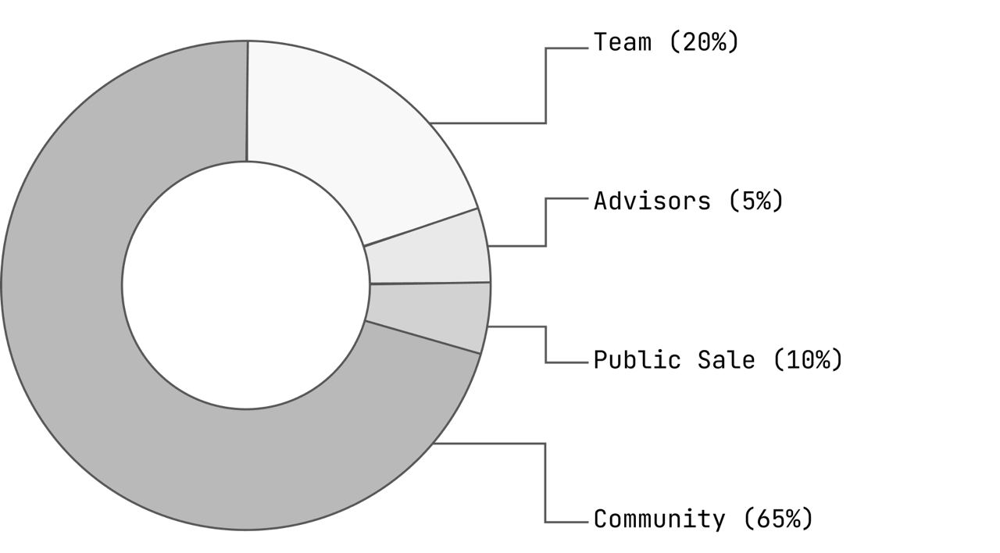
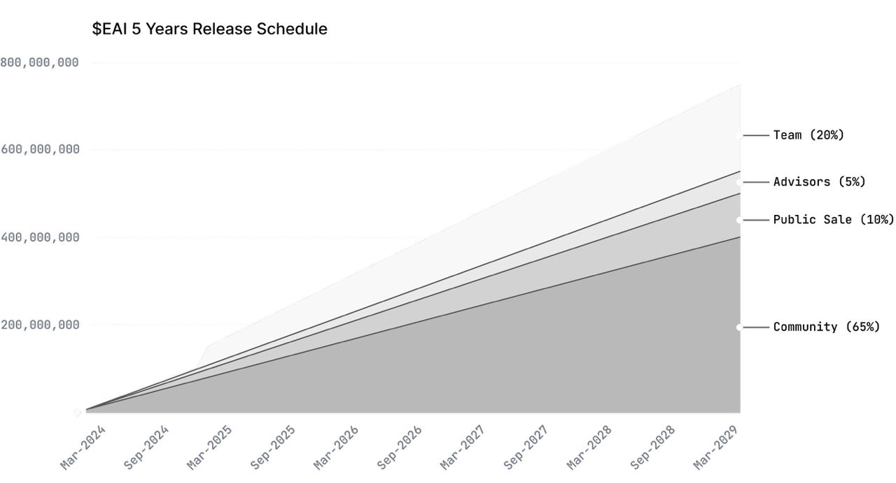

# Tokenomics

## EAI Allocation

The total supply of EAI is permanently fixed at 1 billion tokens.&#x20;

<figure><figcaption></figcaption></figure>

## Release schedule

The majority of the EAI supply is locked and vested over 5 years.&#x20;

<figure><figcaption></figcaption></figure>
