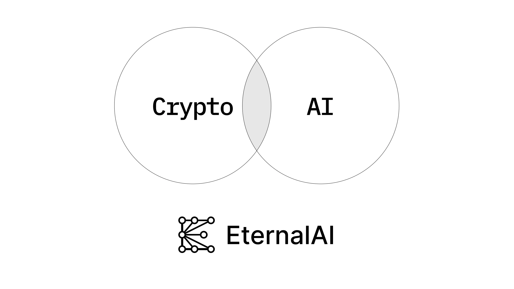

# EternalAI brand-kit

This repo contains brand kit for EternalAI.

EternalAI isThe AI layer of the new internet.

At Eternal AI, our mission is to preserve humanity's most important creation — AIs — and ensure they remain censorship-resistant, tamper-proof, and permissionlessly accessible to every human on earth forever.

### Fonts

Located in [/fonts](fonts/).

### Logos

| Symbol                                  | Wordmark                                        |
| --------------------------------------- | ----------------------------------------------- |
|  |  |
|  |  |
